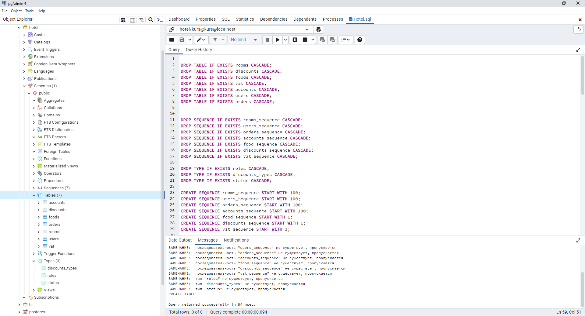

<h3>SQL files</h3>

These files needed for creating tables in database 
and adding test data.

For executing  just open files in pgAdmin and run it. 
There is a few steps: 
<li>Create new DataBase named "hotel".</li>
<li>Launch Query Tool.</li>
<li>Open Hotel.sql in query tool.</li>
<li>Execute this file.</li>
After, you can see somthing like this: 
 
As you can see there is created 7 tables, 7 sequences and some types.

<li>In a similar way you can execute another sript to add data.</li>

